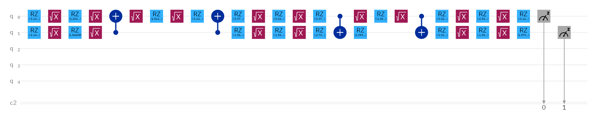

# QNet

# 

QNet is a toolchain to help create, train, and deploy plausible exponentially compact quantum neural networks. I have wanted to make a quantum neural network for a while and finally have done it.

## How it Works

While researching quantum computers and gates, I noticed a startling similarity between classical neural networks and quantum ones. The main idea of this project is to use the fact that quantum gates act like matrices and treat the whole thing as a huge matrix multiplication unit, kind of like how GPUs are used now. However, matrix multiplication is not enough to make a useful neural network due to linear collapse. Looking into the measurement operator, the formula is perfect! The formula is:
$$
p=|s|^2
$$
Which means the probability of the states being measured is equal to the absolute value of state vector which is then squared. This property of the measurement operator gives us the non-linearity needed. The state vector represents the state of each combination of qubits. This means if we have two qubits with two states each ( on and off ) we have 2 to the power of the number of qubits states. This also happens to be why the QNN is 'exponentially efficient.' 

## The Downsides

Most of the downsides with this architecture are a side effect of our current limited quantum computer technology. The issue arises that the state vector has to be normal, so if you have a QNN with 4 inputs, the absolute value of the magnitude of vector needs to equal one. This means with more inputs you're "spreading" out that one across more inputs which means the total dynamic range of all the inputs of the system will decrease. Also since running a quantum computer is a probabilistic process, adding more outputs which could all be saturated, means that you could easily dip below the noise floor of the quantum computer (especially the ones I tested on).

## Implementation

This was actually the hardest part due to a lack of research in this field. The most important component of the system is called the "parametrized unitary matrix." To understand this I'll dive into a bit of the rules of quantum computers. One thing you learn early on is that operators (those matrices I talked about) are unitary meaning that their determinant (how they scale area) is 1 (more formally the absolute value of the determinant is 1). Optimally when we train a network we want it to follow that rule or else it won't be able to be implemented on a real quantum computer (it won't be quantumly plausible). So what are unitary matrices in terms of geometry and linear algebra? Unitary matrices represent, rotations and reflections (operations that keep vectors the same magnitude before and after the operation). However, a very important part of this project is to make the parameters smooth and differentiable for modern gradient based optimization methods. So parametrizing the matrix as a set of rotations and reflections would not work since binary variables (whether there is a reflection or not) are not continuous and have no derivative. Instead, I adapted an existing [2d parametrization from Wikipedia](https://en.wikipedia.org/wiki/Unitary_matrix) to work in any number of dimensions. It is not entirely efficient, as it uses n^2 parameters which is the same as representing the whole matrix. However, because of the inefficiency was easy to implement. I used plane rotations to represent rotations in high dimensional spaces, and extended the phase rotation to higher dimensions too. To translate this into quantum gates that can be ran on a quantum computer, I used `quantum_decomp`. However, with more work, it is probably possible to factorize the plane rotations in state vector space to some general set of quantum gates that act on qubits. The phase transformation probably has some sort of analogue as well.